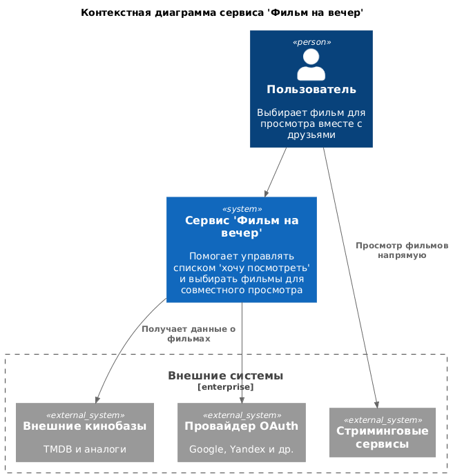
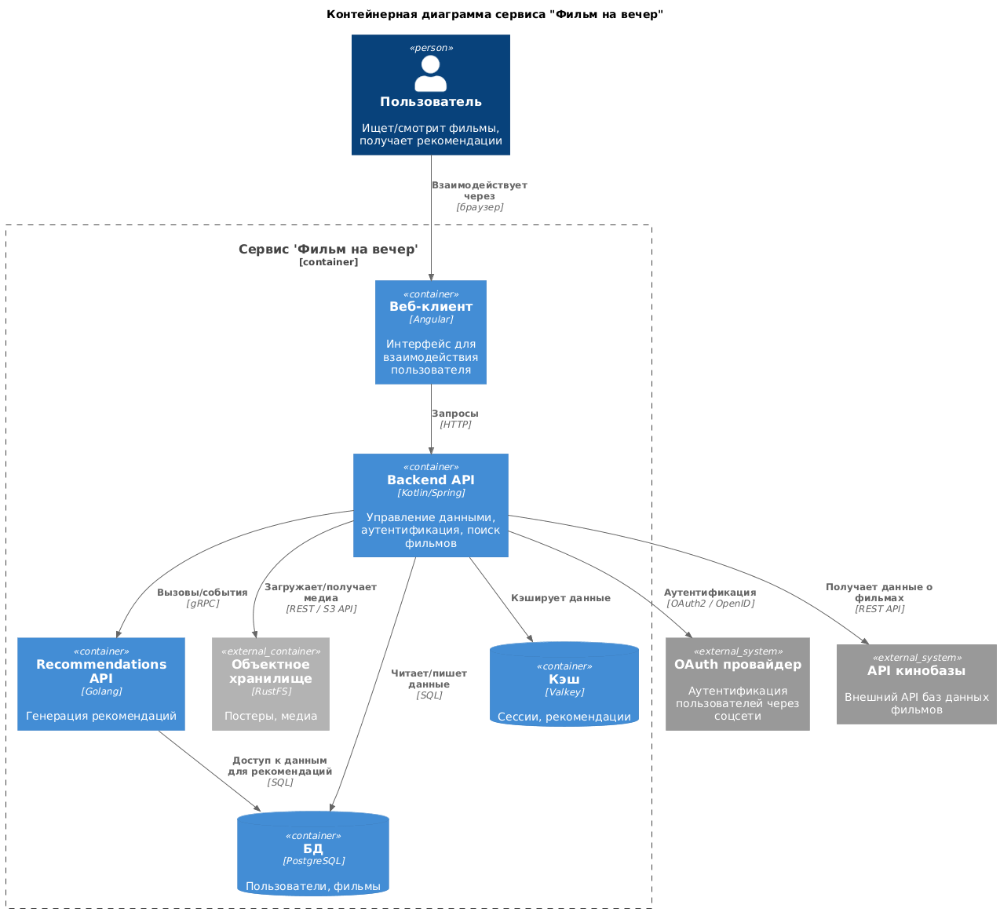
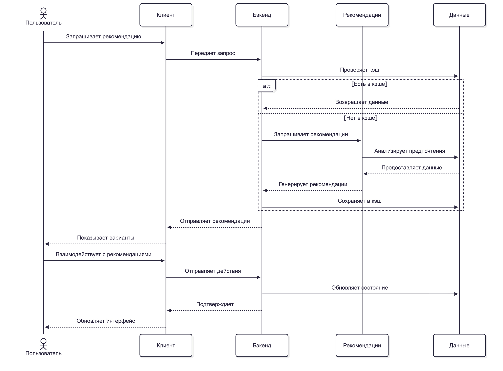

# Team 2 solution

## C4 Context Diagram


```plantuml
@startuml
!define C4P https://raw.githubusercontent.com/plantuml-stdlib/C4-PlantUML/master
!includeurl C4P/C4_Context.puml

Title "Контекстная диаграмма сервиса "Фильм на вечер""

Enterprise_Boundary(b0, "Внешние системы") {
  System_Ext(Streamers, "Стриминговые сервисы", "")
  System_Ext(MovieDB, "Внешние кинобазы", "TMDB и аналоги")
  System_Ext(OAuth, "Провайдер OAuth", "Google, Yandex и др.")
}

Person(User, "Пользователь", "Выбирает фильм для просмотра вместе с друзьями")
System(FilmNight, "Сервис 'Фильм на вечер'", "Помогает управлять списком 'хочу посмотреть' и выбирать фильмы для совместного просмотра")

Rel(User, FilmNight, "")
Rel(FilmNight, OAuth, "")
Rel(FilmNight, MovieDB, "Получает данные о фильмах")
Rel(User, Streamers, "Просмотр фильмов напрямую")
@enduml
```

## C4 Container Diagram


```plantuml
@startuml
!define C4P https://raw.githubusercontent.com/plantuml-stdlib/C4-PlantUML/master
!includeurl C4P/C4_Container.puml

Title "Контейнерная диаграмма сервиса "Фильм на вечер""

Person(user, "Пользователь", "Ищет/смотрит фильмы, получает рекомендации")
System_Ext(oauth, "OAuth провайдер", "Аутентификация пользователей через соцсети")
System_Ext(tmdb, "API кинобазы", "Внешний API баз данных фильмов")

Container_Boundary(app, "Сервис 'Фильм на вечер'") {
  Container(web, "Веб-клиент", "Angular", "Интерфейс для взаимодействия пользователя")
  Container(api, "Backend API", "Kotlin/Spring", "Управление данными, аутентификация, поиск фильмов")
  Container(rec, "Recommendations API", "Golang", "Генерация рекомендаций")
  Container_Ext(storage, "Объектное хранилище", "RustFS", "Постеры, медиа")
  ContainerDb(db, "БД", "PostgreSQL", "Пользователи, фильмы")
  ContainerDb(cache, "Кэш", "Valkey", "Сессии, рекомендации")
}

Rel(user, web, "Взаимодействует через", "браузер")
Rel(web, api, "Запросы", "HTTP")
Rel(api, rec, "Вызовы/события", "gRPC")
Rel(api, db, "Читает/пишет данные", "SQL")
Rel(api, cache, "Кэширует данные", "")
Rel(api, storage, "Загружает/получает медиа", "REST / S3 API")
Rel(rec, db, "Доступ к данным для рекомендаций", "SQL")
Rel(api, oauth, "Аутентификация", "OAuth2 / OpenID")
Rel(api, tmdb, "Получает данные о фильмах", "REST API")

@enduml
```

## Sequence Diagram


```memraid
sequenceDiagram
  actor Пользователь
  participant Клиент
  participant Бэкенд
  participant Рекомендации
  participant Данные
  
  Пользователь->>Клиент: Запрашивает рекомендацию
  Клиент->>Бэкенд: Передает запрос
  Бэкенд->>Данные: Проверяет кэш
  alt Есть в кэше
      Данные-->>Бэкенд: Возвращает данные
  else Нет в кэше
      Бэкенд->>Рекомендации: Запрашивает рекомендации
      Рекомендации->>Данные: Анализирует предпочтения
      Данные-->>Рекомендации: Предоставляет данные
      Рекомендации-->>Бэкенд: Генерирует рекомендации
      Бэкенд->>Данные: Сохраняет в кэш
  end
  Бэкенд-->>Клиент: Отправляет рекомендации
  Клиент-->>Пользователь: Показывает варианты
  
  Пользователь->>Клиент: Взаимодействует с рекомендациями
  Клиент->>Бэкенд: Отправляет действия
  Бэкенд->>Данные: Обновляет состояние
  Бэкенд-->>Клиент: Подтверждает
  Клиент-->>Пользователь: Обновляет интерфейс
```
